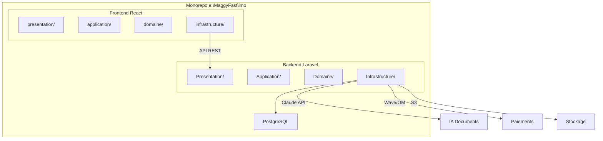
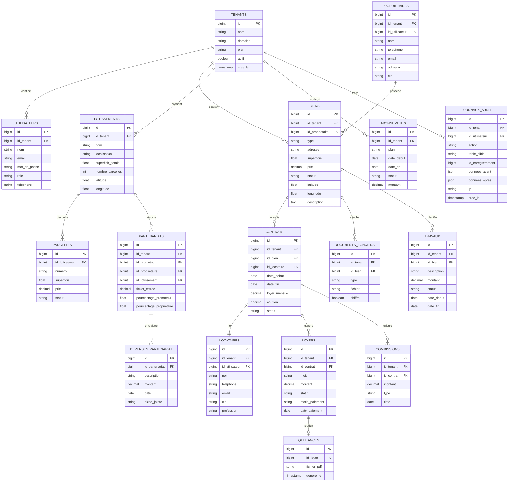

# Architecture Technique — Maggyfast Immo

## 1. Architecture Globale



---

## 2. Clean Architecture — Règle de dépendance

```
Presentation → Application → Domaine ← Infrastructure
```

- **Domaine** : Aucune dépendance externe. Entités pures, Value Objects, Interfaces (contrats).
- **Application** : Dépend uniquement du Domaine. Orchestre les Use Cases.
- **Infrastructure** : Implémente les interfaces du Domaine (Eloquent, API, S3).
- **Presentation** : Controllers/Composants. Dépend de Application.

---

## 3. Backend Laravel — Structure détaillée

```
backend/app/
├── Domaine/
│   ├── Bien/
│   │   ├── Entites/
│   │   │   └── Bien.php                    # Entité métier pure
│   │   ├── ValeursObjets/
│   │   │   ├── TypeBien.php                # Enum: appartement, maison, terrain, commerce
│   │   │   └── StatutBien.php              # Enum: disponible, loué, vendu, en_travaux
│   │   └── Contrats/
│   │       └── DepotBienInterface.php      # Interface repository
│   ├── Locataire/
│   │   ├── Entites/Locataire.php
│   │   └── Contrats/DepotLocataireInterface.php
│   ├── Proprietaire/
│   │   ├── Entites/Proprietaire.php
│   │   └── Contrats/DepotProprietaireInterface.php
│   ├── Contrat/
│   │   ├── Entites/ContratBail.php
│   │   ├── ValeursObjets/StatutContrat.php
│   │   └── Contrats/DepotContratInterface.php
│   ├── Loyer/
│   │   ├── Entites/Loyer.php
│   │   ├── ValeursObjets/StatutLoyer.php   # payé, impayé, partiel
│   │   └── Contrats/DepotLoyerInterface.php
│   ├── Lotissement/
│   │   ├── Entites/Lotissement.php
│   │   ├── Entites/Parcelle.php
│   │   └── Contrats/DepotLotissementInterface.php
│   ├── Partenariat/
│   │   ├── Entites/Partenariat.php
│   │   ├── Entites/DepensePartenariat.php
│   │   ├── Services/CalculateurRepartition.php  # Logique métier pure
│   │   └── Contrats/DepotPartenariatInterface.php
│   ├── Document/
│   │   ├── Entites/DocumentFoncier.php
│   │   └── Contrats/DepotDocumentInterface.php
│   └── Partage/
│       ├── Contrats/ServicePdfInterface.php
│       └── Contrats/ServiceIAInterface.php
│
├── Application/
│   ├── Bien/
│   │   ├── CreerBien.php                   # Use Case
│   │   ├── ListerBiens.php
│   │   ├── ModifierBien.php
│   │   └── SupprimerBien.php
│   ├── Locataire/
│   │   ├── CreerLocataire.php
│   │   └── ...
│   ├── Contrat/
│   │   ├── CreerContrat.php
│   │   └── ...
│   ├── Loyer/
│   │   ├── EnregistrerPaiement.php
│   │   ├── GenererQuittance.php
│   │   └── ...
│   ├── Partenariat/
│   │   ├── CreerPartenariat.php
│   │   ├── CalculerRepartition.php
│   │   └── ...
│   └── IA/
│       └── GenererDocumentIA.php
│
├── Infrastructure/
│   ├── Persistence/
│   │   ├── Modeles/                        # Modèles Eloquent (mapping BDD)
│   │   │   ├── ModeleBien.php
│   │   │   ├── ModeleLocataire.php
│   │   │   ├── ModeleProprietaire.php
│   │   │   ├── ModeleContrat.php
│   │   │   ├── ModeleLoyer.php
│   │   │   ├── ModeleLotissement.php
│   │   │   ├── ModeleParcelle.php
│   │   │   ├── ModelePartenariat.php
│   │   │   └── ModeleDocumentFoncier.php
│   │   └── Depots/                         # Implémentations Eloquent
│   │       ├── DepotBienEloquent.php
│   │       ├── DepotLocataireEloquent.php
│   │       └── ...
│   ├── Services/
│   │   ├── ServicePdfDomPdf.php
│   │   ├── ServiceIAClaude.php
│   │   ├── ServicePaiementWave.php
│   │   └── ServicePaiementOrangeMoney.php
│   └── Middleware/
│       ├── AssureTenant.php
│       └── VerifieRole.php
│
└── Presentation/
    ├── Controlleurs/
    │   ├── ControlleurAuth.php
    │   ├── ControlleurBien.php
    │   ├── ControlleurLocataire.php
    │   ├── ControlleurProprietaire.php
    │   ├── ControlleurContrat.php
    │   ├── ControlleurLoyer.php
    │   ├── ControlleurQuittance.php
    │   ├── ControlleurLotissement.php
    │   ├── ControlleurParcelle.php
    │   ├── ControlleurPartenariat.php
    │   ├── ControlleurDocumentFoncier.php
    │   ├── ControlleurTravaux.php
    │   ├── ControlleurCommission.php
    │   ├── ControlleurTableauDeBord.php
    │   ├── ControlleurIA.php
    │   ├── ControlleurCarte.php
    │   └── ControlleurAdminSaas.php
    ├── Requetes/                            # Form Requests (validation)
    │   ├── RequeteCreerBien.php
    │   ├── RequeteCreerLocataire.php
    │   └── ...
    └── Ressources/                          # API Resources (transformation)
        ├── RessourceBien.php
        ├── RessourceLocataire.php
        └── ...
```

---

## 4. Frontend React — Structure détaillée

```
frontend/src/
├── domaine/
│   ├── entites/
│   │   ├── Bien.js                         # Entité pure
│   │   ├── Locataire.js
│   │   ├── Proprietaire.js
│   │   ├── Contrat.js
│   │   ├── Loyer.js
│   │   ├── Lotissement.js
│   │   ├── Parcelle.js
│   │   ├── Partenariat.js
│   │   └── Utilisateur.js
│   ├── valeursObjets/
│   │   ├── typeBien.js
│   │   ├── statutLoyer.js
│   │   └── rolleUtilisateur.js
│   └── validations/
│       ├── validationBien.js               # Règles métier pures
│       ├── validationLocataire.js
│       └── validationContrat.js
│
├── application/
│   ├── hooks/
│   │   ├── utiliserBiens.js                # Hook: CRUD biens
│   │   ├── utiliserLocataires.js
│   │   ├── utiliserProprietaires.js
│   │   ├── utiliserContrats.js
│   │   ├── utiliserLoyers.js
│   │   ├── utiliserLotissements.js
│   │   ├── utiliserPartenariats.js
│   │   ├── utiliserTableauDeBord.js
│   │   ├── utiliserAuth.js
│   │   └── utiliserIA.js
│   ├── contexte/
│   │   ├── ContexteAuth.jsx
│   │   └── ContexteTenant.jsx
│   └── casUtilisation/
│       ├── calculerRepartition.js
│       └── genererDocument.js
│
├── infrastructure/
│   ├── api/
│   │   ├── clientHttp.js                   # Instance axios configurée
│   │   ├── serviceBien.js                  # Appels API biens
│   │   ├── serviceLocataire.js
│   │   ├── serviceProprietaire.js
│   │   ├── serviceContrat.js
│   │   ├── serviceLoyer.js
│   │   ├── serviceLotissement.js
│   │   ├── servicePartenariat.js
│   │   ├── serviceDocument.js
│   │   ├── serviceIA.js
│   │   └── serviceAuth.js
│   └── stockage/
│       └── stockageLocal.js
│
├── presentation/
│   ├── composants/
│   │   ├── communs/
│   │   │   ├── BarreLaterale.jsx           # Sidebar
│   │   │   ├── EnTete.jsx                  # Header
│   │   │   ├── Bouton.jsx
│   │   │   ├── Carte.jsx                   # Card component
│   │   │   ├── Modal.jsx
│   │   │   ├── Tableau.jsx
│   │   │   ├── ChampFormulaire.jsx
│   │   │   ├── Chargement.jsx              # Loader/Spinner
│   │   │   └── Pagination.jsx
│   │   ├── biens/
│   │   │   ├── CarteBien.jsx
│   │   │   ├── FormulaireBien.jsx
│   │   │   └── ListeBiens.jsx
│   │   ├── locataires/
│   │   │   ├── CarteLocataire.jsx
│   │   │   └── FormulaireLocataire.jsx
│   │   ├── loyers/
│   │   │   ├── LigneLoyer.jsx
│   │   │   └── FormulaireLoyer.jsx
│   │   ├── carte/
│   │   │   ├── CarteInteractive.jsx        # Map Leaflet
│   │   │   └── MarqueurBien.jsx
│   │   └── tableauDeBord/
│   │       ├── CarteStatistique.jsx
│   │       └── GraphiqueLoyers.jsx
│   ├── pages/
│   │   ├── PageConnexion.jsx
│   │   ├── PageInscription.jsx
│   │   ├── PageTableauDeBord.jsx
│   │   ├── PageBiens.jsx
│   │   ├── PageDetailBien.jsx
│   │   ├── PageProprietaires.jsx
│   │   ├── PageLocataires.jsx
│   │   ├── PageContrats.jsx
│   │   ├── PageLoyers.jsx
│   │   ├── PageLotissements.jsx
│   │   ├── PageParcelles.jsx
│   │   ├── PagePartenariats.jsx
│   │   ├── PageDocumentsFonciers.jsx
│   │   ├── PageTravaux.jsx
│   │   ├── PageCarte.jsx
│   │   ├── PageIA.jsx
│   │   ├── PagePortailProprietaire.jsx
│   │   ├── PagePortailLocataire.jsx
│   │   └── PageAdminSaas.jsx
│   └── miseEnPage/
│       ├── MiseEnPagePrincipale.jsx        # Layout avec sidebar
│       ├── MiseEnPageAuth.jsx              # Layout connexion
│       └── MiseEnPagePortail.jsx           # Layout portails
│
└── styles/
    ├── variables.css                       # Design tokens
    ├── global.css                          # Reset + base
    ├── composants.css                      # Styles composants
    └── pages.css                           # Styles pages
```

---

## 5. Schéma Base de Données



---

## 6. Multi-Tenancy

**Approche** : Colonne `id_tenant` sur chaque table métier.

**Implémentation** :
- Trait `AppartientAuTenant` sur chaque modèle Eloquent
- Global Scope automatique filtrant par `id_tenant`
- Middleware `AssureTenant` injectant le tenant depuis le token JWT
- Isolation stricte : aucun accès cross-tenant possible

---

## 7. Sécurité

| Mesure | Implémentation |
|---|---|
| HTTPS / SSL | Nginx reverse proxy |
| Auth | Laravel Sanctum (tokens) |
| Rôles | `spatie/laravel-permission` |
| Chiffrement docs | `openssl_encrypt` AES-256-CBC |
| Audit | Table `journaux_audit` + Observer Eloquent |
| CORS | Configuration Laravel CORS |
| Validation | Form Requests sur chaque endpoint |
| Rate limiting | Middleware throttle Laravel |

---

## 8. Routes API

```
POST   /api/auth/connexion
POST   /api/auth/inscription
POST   /api/auth/deconnexion
GET    /api/auth/moi

GET|POST        /api/biens
GET|PUT|DELETE  /api/biens/{id}

GET|POST        /api/proprietaires
GET|PUT|DELETE  /api/proprietaires/{id}

GET|POST        /api/locataires
GET|PUT|DELETE  /api/locataires/{id}

GET|POST        /api/contrats
GET|PUT|DELETE  /api/contrats/{id}

GET|POST        /api/loyers
PUT             /api/loyers/{id}/payer
GET             /api/quittances/{id}/pdf

GET|POST        /api/lotissements
GET|PUT|DELETE  /api/lotissements/{id}

GET|POST        /api/parcelles
GET|PUT|DELETE  /api/parcelles/{id}

GET|POST        /api/partenariats
GET             /api/partenariats/{id}/calculer-repartition
GET|PUT|DELETE  /api/partenariats/{id}

GET|POST        /api/documents-fonciers
GET|DELETE      /api/documents-fonciers/{id}

GET|POST        /api/travaux
GET|PUT|DELETE  /api/travaux/{id}

GET|POST        /api/commissions

GET             /api/tableau-de-bord
GET             /api/carte/biens
GET             /api/carte/lotissements

POST            /api/ia/generer-document

GET|POST        /api/admin/tenants
GET|PUT|DELETE  /api/admin/tenants/{id}
GET|POST        /api/admin/abonnements
```
