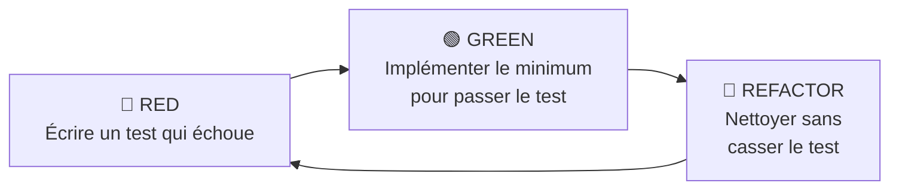

# Directives de Développement — Maggyfast Immo

## Principes Fondamentaux

| Principe | Règle |
|---|---|
| **KISS** | Simplicité maximale. Si c'est complexe, refactoriser. |
| **YAGNI** | Ne développer que le nécessaire. Pas de fonctionnalité spéculative. |
| **SRP** | 1 fonction = 1 action. 1 classe = 1 responsabilité. 1 fichier = 1 module. |
| **DIP** | Dépendre d'abstractions (interfaces), pas d'implémentations. |

---

## TDD — Cycle Obligatoire



### Règles TDD strictes

1. **Jamais de code sans test préalable**
2. Un test = un comportement attendu
3. Tests unitaires : isolés, déterministes, rapides
4. Tests feature (API) : vérifier les réponses HTTP + données BDD
5. Mocker les services externes (Claude API, Wave, S3)

### Structure des tests — Backend

```
tests/
├── Unit/
│   ├── Domaine/
│   │   ├── Bien/
│   │   │   └── BienTest.php
│   │   ├── Loyer/
│   │   │   └── LoyerTest.php
│   │   └── Partenariat/
│   │       └── CalculateurRepartitionTest.php
│   └── Application/
│       ├── CreerBienTest.php
│       └── EnregistrerPaiementTest.php
└── Feature/
    ├── Api/
    │   ├── BienApiTest.php
    │   ├── LocataireApiTest.php
    │   ├── ContratApiTest.php
    │   └── LoyerApiTest.php
    └── Auth/
        └── AuthenticationTest.php
```

### Structure des tests — Frontend

```
tests/
├── domaine/
│   ├── validationBien.test.js
│   └── validationContrat.test.js
├── application/
│   ├── utiliserBiens.test.js
│   └── calculerRepartition.test.js
└── presentation/
    ├── CarteBien.test.jsx
    └── FormulaireBien.test.jsx
```

### Exemple TDD Backend

```php
// 1. RED — tests/Unit/Domaine/Loyer/LoyerTest.php
public function test_le_loyer_est_impaye_par_defaut(): void
{
    $loyer = new Loyer(mois: '2026-01', montant: 150000);
    $this->assertEquals(StatutLoyer::IMPAYE, $loyer->statut());
}

// 2. GREEN — app/Domaine/Loyer/Entites/Loyer.php
class Loyer
{
    public function __construct(
        private string $mois,
        private int $montant,
        private StatutLoyer $statut = StatutLoyer::IMPAYE
    ) {}

    public function statut(): StatutLoyer
    {
        return $this->statut;
    }
}

// 3. REFACTOR — si nécessaire
```

### Exemple TDD Frontend

```javascript
// 1. RED — tests/domaine/validationBien.test.js
import { validerBien } from '../../src/domaine/validations/validationBien';

test('rejette un bien sans adresse', () => {
  const erreurs = validerBien({ type: 'appartement', adresse: '' });
  expect(erreurs.adresse).toBe('L\'adresse est obligatoire');
});

// 2. GREEN — src/domaine/validations/validationBien.js
export function validerBien(bien) {
  const erreurs = {};
  if (!bien.adresse) erreurs.adresse = "L'adresse est obligatoire";
  return erreurs;
}

// 3. REFACTOR — si nécessaire
```

---

## Clean Architecture — Règles

### Backend Laravel

| Couche | Doit contenir | Ne doit PAS contenir |
|---|---|---|
| **Domaine** | Entités pures, Value Objects, Interfaces | Eloquent, HTTP, Laravel facades |
| **Application** | Use Cases, orchestration | Accès BDD direct, réponses HTTP |
| **Infrastructure** | Modèles Eloquent, repos, services externes | Logique métier |
| **Presentation** | Controllers, Requests, Resources | Logique métier, requêtes SQL |

### Frontend React

| Couche | Doit contenir | Ne doit PAS contenir |
|---|---|---|
| **domaine** | Entités JS, validations, règles pures | `axios`, `useState`, JSX |
| **application** | Custom hooks, context, cas d'utilisation | JSX, appels API directs |
| **infrastructure** | Appels API axios, localStorage | JSX, logique métier |
| **presentation** | Composants JSX, pages, layouts | Appels API, logique métier |

> [!CAUTION]
> **Aucune logique métier dans les composants UI.** Les composants appellent des hooks (`application/`), qui utilisent des services (`infrastructure/`), validés par des règles (`domaine/`).

---

## Conventions de Nommage (Français)

### Fichiers

| Type | Convention | Exemple |
|---|---|---|
| Entité domaine | `PascalCase` | `Bien.php`, `Locataire.js` |
| Use Case | `PascalCase` verbe | `CreerBien.php` |
| Controller | `Controlleur` + entité | `ControlleurBien.php` |
| Hook React | `utiliser` + entité | `utiliserBiens.js` |
| Service API | `service` + entité | `serviceBien.js` |
| Composant | `PascalCase` descriptif | `CarteBien.jsx`, `FormulaireBien.jsx` |
| Page | `Page` + nom | `PageBiens.jsx` |
| Test | Nom + `.test` | `BienTest.php`, `validationBien.test.js` |
| Validation | `validation` + entité | `validationBien.js` |

### Fonctions & Méthodes

| Action | Préfixe | Exemple |
|---|---|---|
| Créer | `creer` | `creerBien()` |
| Lister | `lister` | `listerBiens()` |
| Obtenir | `obtenir` | `obtenirBienParId()` |
| Modifier | `modifier` | `modifierBien()` |
| Supprimer | `supprimer` | `supprimerBien()` |
| Calculer | `calculer` | `calculerRepartition()` |
| Valider | `valider` | `validerContrat()` |
| Generer | `generer` | `genererQuittancePdf()` |

### Variables & Colonnes BDD

- **Colonnes** : `snake_case` français → `id_tenant`, `id_proprietaire`, `loyer_mensuel`
- **Variables PHP** : `$camelCase` français → `$loyerMensuel`, `$idTenant`
- **Variables JS** : `camelCase` français → `loyerMensuel`, `idTenant`

---

## Git Workflow

### Branches

```
main                    # Production stable
├── develop             # Intégration continue
│   ├── feature/module-biens
│   ├── feature/module-loyers
│   ├── feature/module-lotissements
│   └── fix/correction-calcul-repartition
```

### Commits (conventionnels, en français)

```
feat(biens): ajouter le CRUD des biens immobiliers
fix(loyers): corriger le calcul du loyer partiel
test(contrats): ajouter tests unitaires ContratBail
refactor(partenariats): extraire CalculateurRepartition
docs(api): documenter les endpoints loyers
```

---

## Checklist Code Review

- [ ] Test écrit AVANT le code ?
- [ ] Tests passent (rouge → vert) ?
- [ ] Une seule responsabilité par fonction/classe ?
- [ ] Aucune logique métier dans la UI ?
- [ ] Dépendances injectées (pas de `new` dans le métier) ?
- [ ] Noms français, explicites, orientés action ?
- [ ] Pas de code mort ni de TODO ?
- [ ] Validation des données en entrée ?
- [ ] Isolation tenant respectée ?

---

## Anti-Patterns à Éviter

| ❌ Ne pas faire | ✅ Faire |
|---|---|
| God Class (classe de 500+ lignes) | Découper en classes SRP |
| Logique métier dans Controller | Extraire dans Use Case / Domaine |
| `axios` dans un composant React | Service dans `infrastructure/api/` |
| `if/else` profonds (3+ niveaux) | Early return, pattern strategy |
| Données hardcodées | Configuration / constantes nommées |
| `console.log()` en production | Logging structuré |
| Tests qui dépendent de l'ordre | Tests isolés et indépendants |
