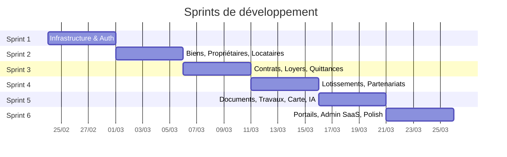

# Feuille de Route — Maggyfast Immo

## Vue d'ensemble

---

## Sprint 1 — Infrastructure & Authentification

**Objectif** : Monorepo fonctionnel, auth opérationnelle, design system posé.

### Backend
- [ ] Initialiser Laravel, configurer PostgreSQL
- [ ] Mettre en place Clean Architecture (`Domaine/Application/Infrastructure/Presentation`)
- [ ] Migration `tenants`, `utilisateurs`
- [ ] Trait `AppartientAuTenant`, Middleware `AssureTenant`
- [ ] Auth Sanctum : connexion, inscription, déconnexion
- [ ] Tests TDD : 100% couverture auth

### Frontend
- [ ] Initialiser React Vite, installer dépendances
- [ ] Design system : `variables.css` (couleurs `#E4403D`, noir, typo Inter)
- [ ] Composants communs : `BarreLaterale`, `EnTete`, `Bouton`, `ChampFormulaire`
- [ ] `MiseEnPagePrincipale` + `MiseEnPageAuth`
- [ ] Pages : `PageConnexion`, `PageInscription`
- [ ] `ContexteAuth`, `utiliserAuth` hook
- [ ] `clientHttp.js` avec intercepteurs token

### Critères d'acceptation
- ✅ L'utilisateur peut s'inscrire, se connecter, se déconnecter
- ✅ Le token Sanctum est géré automatiquement
- ✅ Le sidebar + header s'affichent correctement
- ✅ Tous les tests passent

---

## Sprint 2 — Biens, Propriétaires, Locataires

**Objectif** : CRUD complet pour les 3 entités core.

### Backend
- [ ] Migrations `biens`, `proprietaires`, `locataires`
- [ ] Entités domaine + interfaces repository
- [ ] Use Cases : `CreerBien`, `ListerBiens`, `ModifierBien`, `SupprimerBien` (idem propriétaires, locataires)
- [ ] Repositories Eloquent
- [ ] Controllers API REST
- [ ] Form Requests + Resources
- [ ] Tests TDD : unit + feature

### Frontend
- [ ] `serviceBien.js`, `serviceProprietaire.js`, `serviceLocataire.js`
- [ ] Hooks : `utiliserBiens`, `utiliserProprietaires`, `utiliserLocataires`
- [ ] Pages : `PageBiens`, `PageDetailBien`, `PageProprietaires`, `PageLocataires`
- [ ] Composants : `CarteBien`, `FormulaireBien`, `ListeBiens`
- [ ] `Tableau` composant réutilisable avec pagination

### Critères d'acceptation
- ✅ CRUD fonctionnel pour biens, propriétaires, locataires
- ✅ Liaison propriétaire ↔ biens
- ✅ Recherche et filtres basiques
- ✅ Tous les tests passent

---

## Sprint 3 — Contrats, Loyers, Quittances PDF

**Objectif** : Gestion locative complète avec génération PDF.

### Backend
- [ ] Migrations `contrats`, `loyers`, `quittances`
- [ ] Entités + Use Cases contrats et loyers
- [ ] `EnregistrerPaiement` use case (avec modes Wave/OM stubs)
- [ ] `GenererQuittance` use case
- [ ] `ServicePdfDomPdf` → génération PDF quittances
- [ ] Template Blade pour quittance PDF
- [ ] Tests TDD complets

### Frontend
- [ ] Pages : `PageContrats`, `PageLoyers`
- [ ] Formulaire création contrat (sélection bien + locataire)
- [ ] Tableau des loyers avec statut (payé/impayé/partiel)
- [ ] Bouton "Télécharger quittance" → PDF
- [ ] Indicateurs visuels de statut (badges colorés)

### Critères d'acceptation
- ✅ Créer un contrat lié à un bien et un locataire
- ✅ Enregistrer un paiement de loyer
- ✅ Générer et télécharger une quittance PDF
- ✅ Tous les tests passent

---

## Sprint 4 — Lotissements & Partenariats

**Objectif** : Gestion foncière et calculateur de répartition.

### Backend
- [ ] Migrations `lotissements`, `parcelles`, `partenariats`, `depenses_partenariat`
- [ ] `CalculateurRepartition` service domaine pur
- [ ] Use Cases CRUD + endpoint calculer répartition
- [ ] Tests TDD (logique de répartition critique)

### Frontend
- [ ] Pages : `PageLotissements`, `PageParcelles`, `PagePartenariats`
- [ ] Visualisation parcelles (grille ou plan)
- [ ] Calculateur interactif de répartition (%)
- [ ] Tableau des dépenses avec totaux

### Critères d'acceptation
- ✅ CRUD lotissements et parcelles
- ✅ Créer un partenariat promoteur/propriétaire
- ✅ Le calculateur affiche correctement les parts
- ✅ Tous les tests passent

---

## Sprint 5 — Documents, Travaux, Carte, IA

**Objectif** : Modules avancés — stockage sécurisé, carte interactive, IA.

### Backend
- [ ] Migrations `documents_fonciers`, `travaux`, `commissions`
- [ ] Upload/download fichiers avec chiffrement AES-256
- [ ] `ServiceIAClaude` → intégration Claude API
- [ ] Endpoints carte (biens + lotissements géolocalisés)
- [ ] Tests TDD

### Frontend
- [ ] `PageDocumentsFonciers` — upload, liste, téléchargement
- [ ] `PageTravaux` — suivi travaux et dépenses
- [ ] `PageCarte` — Leaflet avec marqueurs biens/lotissements + filtres
- [ ] `PageIA` — formulaire type document → génération → aperçu → PDF
- [ ] Composants carte : `CarteInteractive`, `MarqueurBien`

### Critères d'acceptation
- ✅ Upload et téléchargement sécurisé de documents
- ✅ Carte interactive avec filtres fonctionnels
- ✅ Génération de document IA (stub si pas de clé API)
- ✅ Tous les tests passent

---

## Sprint 6 — Portails, Admin SaaS, Polish

**Objectif** : Portails utilisateurs, administration, finitions.

### Backend
- [ ] Migrations `abonnements`, `journaux_audit`
- [ ] Endpoints portail propriétaire (biens, revenus, documents)
- [ ] Endpoints portail locataire (contrat, loyers, quittances)
- [ ] Endpoints admin SaaS (tenants, abonnements)
- [ ] Observer Eloquent pour journaux d'audit
- [ ] Tests TDD

### Frontend
- [ ] `PagePortailProprietaire` — vue simplifiée biens + revenus
- [ ] `PagePortailLocataire` — vue contrat + historique loyers
- [ ] `PageAdminSaas` — gestion tenants et abonnements
- [ ] `PageTableauDeBord` — widget stats + graphiques (Recharts)
- [ ] Responsive design final
- [ ] Micro-animations et transitions
- [ ] Dark mode (optionnel)

### Critères d'acceptation
- ✅ Propriétaire voit ses biens et revenus
- ✅ Locataire voit son contrat et ses loyers
- ✅ Admin peut gérer les tenants
- ✅ Dashboard affiche des statistiques pertinentes
- ✅ Application responsive et polish visuel
- ✅ Tous les tests passent

---

## Métriques de Qualité

| Métrique | Cible |
|---|---|
| Couverture tests domaine | > 90% |
| Couverture tests API | > 80% |
| Taille max fonction | 20 lignes |
| Taille max fichier | 200 lignes |
| Dépendances circulaires | 0 |
| Tests en échec | 0 |
